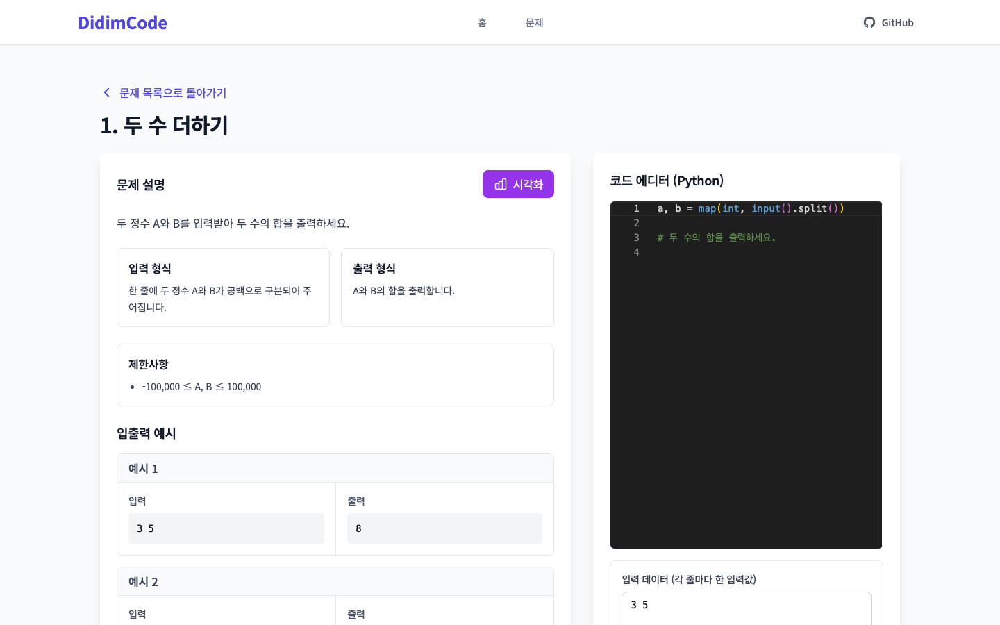
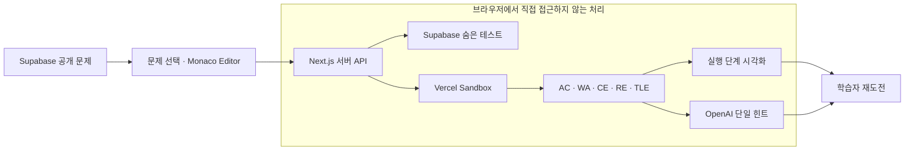

# DidimCode

Python 실행 과정을 단계별로 시각화하고, 정답 대신 다음 풀이를 위한 핵심 AI 힌트 하나를 제공하는 알고리즘 학습 서비스입니다.

*An algorithm learning service that visualizes Python execution step by step and gives one focused AI hint instead of revealing the answer.*

**[Live Demo](https://didimcode.vercel.app/) · [Build & Deployment Guide](docs/build-and-deploy.md)**

## 문제와 학습 목표

초보 학습자는 코드가 틀렸다는 결과만으로 반복·분기·함수 호출 과정의 어느 지점에서 생각이 어긋났는지 찾기 어렵습니다. 반대로 완성된 정답이나 과도한 AI 설명은 직접 디버깅할 기회를 줄일 수 있습니다.

DidimCode는 실행 상태를 관찰할 수 있게 만들고, 실제 채점 결과를 근거로 가장 먼저 확인할 힌트 하나만 제공해 학습자가 다음 시도를 직접 이어가도록 설계했습니다.

## 핵심 기능

- Monaco Editor에서 Python 코드 작성
- Vercel Sandbox 기반 격리 실행
- 공개 예시와 숨은 테스트를 결합한 채점
- `AC`, `WA`, `CE`, `RE`, `TLE` 판정
- 반복·분기·함수 호출·반환·변수·스택·출력의 단계별 시각화
- 판정과 문제별 설정을 반영한 단일 AI 힌트
- 기초 문법부터 탐색·정렬·동적 계획법까지 초보자용 문제 20개

## 학습 흐름과 데이터 경계

브라우저는 출판된 문제와 공개 예시만 읽습니다. 숨은 테스트, 모범 답안, 채점 설정과 AI API는 Next.js 서버 경계를 통해서만 사용하며, 제출 코드는 일회성 Sandbox에서 실행합니다.

## 주요 구현과 기술적 결정

- 코드 실행과 채점을 동일한 Python 환경의 Vercel Sandbox에 격리하고 실행 후 Sandbox를 종료합니다.
- 문제별 공개 예시와 숨은 테스트를 분리해 학습용 정보와 평가용 데이터를 구분합니다.
- 실행 trace에서 현재 줄, 지역·전역 변수, 호출 스택과 출력을 동기화해 한 단계씩 재생할 수 있게 했습니다.
- AI가 정답 코드나 여러 해결책을 나열하지 않고 판정에 맞는 핵심 힌트 하나를 반환하도록 입력과 출력 규칙을 제한했습니다.
- 문제 원본 JSON에서 seed SQL을 재생성해 20개 문제와 채점 설정을 반복 가능하게 관리합니다.

## 현재 프로덕션과 연구 자산

현재 서비스는 `frontend`의 Next.js 15 애플리케이션을 중심으로 Monaco Editor, Vercel Sandbox, Supabase와 OpenAI API를 사용합니다.

루트의 `backend`, Docker Compose와 DMOJ 관련 문서는 FastAPI·DMOJ 기반 초기 연구 프로토타입의 자산입니다. 현재 Production의 실행·채점 경로와 구분하며, 새로운 배포 설명은 [build-and-deploy](docs/build-and-deploy.md)를 기준으로 합니다.

## 검증과 현재 한계

- ESLint와 Next.js production build로 프론트엔드와 서버 API를 검증합니다.
- 문제 원본에서 seed SQL을 재생성해 데이터 변경의 재현성을 확인합니다.
- Supabase migration은 공개 문제와 숨은 채점 데이터의 읽기 권한을 분리합니다.

현재는 Python 문제를 중심으로 제공하며 Sandbox의 실행 시간과 리소스 제한을 적용합니다. 생성형 AI 힌트는 같은 제출에도 표현이 달라질 수 있습니다. 실제 사용자 평가 결과는 검증된 표본과 분석이 확보되기 전까지 성과로 제시하지 않습니다.

## 기술 스택

| 영역 | 기술 |
| --- | --- |
| Web | Next.js 15, React, TypeScript, Tailwind CSS |
| Editor | Monaco Editor |
| Execution | Vercel Sandbox, Python |
| Data | Supabase Postgres |
| AI | OpenAI API |
| Delivery | Vercel |

## 논문과 성과

- 「피드백 및 시각화 기반 알고리즘 학습지원 플랫폼의 구현 및 사용자 평가 설계」 — 제59회 한국정보통신학회 춘계종합학술대회, [DBpia](https://www.dbpia.co.kr/journal/articleDetail?nodeId=NODE12891475)
- 「피드백 및 시각화 기반 알고리즘 학습지원 플랫폼」 — The 3rd NextGen AI Horizon Forum, [자료집](https://drive.google.com/file/d/1CUKbRZOkcpY3d7RWZTR9dNIyc6F0cEWl/view)
- 2026 한국정보통신학회 춘계종합학술대회 학생우수논문상
- [프로덕션 서비스](https://didimcode.vercel.app/) 배포

## 관련 문서

- [빌드 및 배포 가이드](docs/build-and-deploy.md)
- [테스트 케이스 데이터 가이드](TEST_CASES_GUIDE.md)
- [DMOJ 연동 기록](DMOJ_INTEGRATION_GUIDE.md) — 초기 연구 프로토타입
