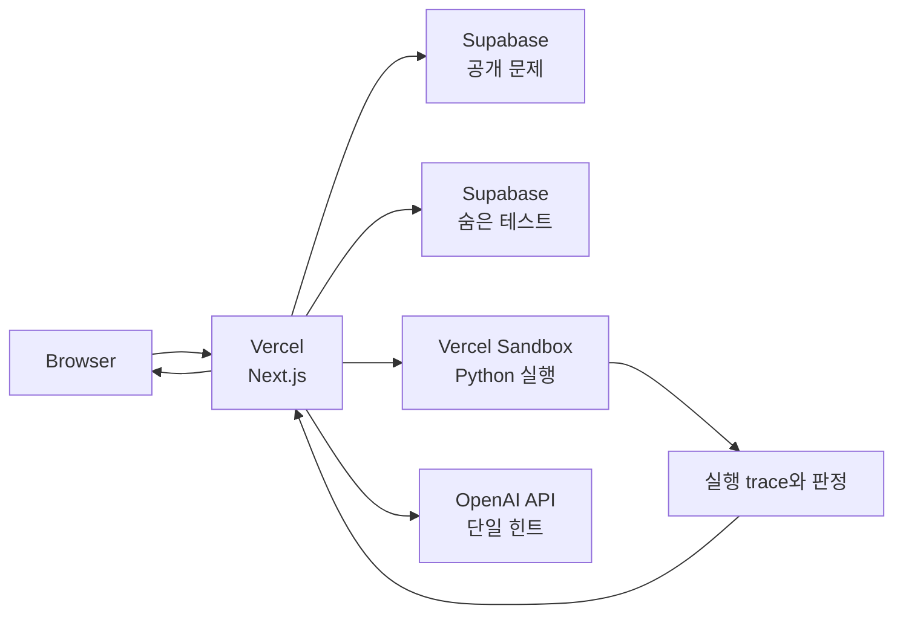

# DidimCode Build & Deployment Guide

이 문서는 현재 Next.js·Vercel Sandbox 기반 DidimCode의 로컬 실행, 검증, 데이터 준비와 Vercel 배포를 관리하는 canonical 문서입니다.

## 프로덕션 아키텍처



브라우저 요청은 Next.js page와 API route가 함께 처리합니다. 서버 API만 Supabase의 숨은 채점 데이터, Vercel Sandbox와 OpenAI API에 접근하며 브라우저에는 필요한 결과만 반환합니다.

## 요구 환경

- Node.js 24.x
- npm
- Vercel 프로젝트와 Sandbox 사용 권한
- Supabase 프로젝트
- OpenAI API key

## 로컬 실행

```bash
git clone https://github.com/back0319/didim-code.git
cd didim-code/frontend
npm ci
cp .env.example .env.local
npm run dev
```

브라우저에서 http://localhost:3000을 엽니다. 로컬에서도 코드 실행·시각화·제출을 확인하려면 Vercel Sandbox와 외부 서비스 환경 변수가 필요합니다.

## 환경 변수

`frontend/.env.example`을 복사해 `.env.local`을 만들고 실제 값은 Git에 커밋하지 않습니다.

| 변수 | 공개 범위 | 설명 |
| --- | --- | --- |
| `NEXT_PUBLIC_SUPABASE_URL` | Browser | Supabase 프로젝트 URL |
| `NEXT_PUBLIC_SUPABASE_PUBLISHABLE_KEY` | Browser | 공개 문제를 읽는 publishable key |
| `SUPABASE_SECRET_KEY` | Secret | 숨은 테스트와 서버 전용 데이터 접근 |
| `OPENAI_API_KEY` | Secret | 힌트 생성 API key |
| `OPENAI_MODEL` | Server only | 사용할 모델의 선택적 override |

`SUPABASE_SECRET_KEY`와 `OPENAI_API_KEY`는 Next.js API route에서만 읽고 브라우저 번들이나 Git 기록에 포함하지 않습니다.

## 검증과 빌드

```bash
cd frontend
npm ci
npm run lint
npx tsc --noEmit
npm run build
```

실제 실행 경로는 다음을 추가로 확인합니다.

1. 공개 문제 목록이 publishable key로 조회되는지 확인합니다.
2. `/api/run`이 제출 코드를 Sandbox에서 실행하고 정리하는지 확인합니다.
3. `/api/visualize`가 실행 trace를 반환하는지 확인합니다.
4. `/api/submit`이 숨은 테스트를 서버에서만 읽고 판정을 반환하는지 확인합니다.
5. 오답 제출에서 정답 코드 대신 핵심 힌트 하나만 반환되는지 확인합니다.

## 문제 데이터와 마이그레이션

- 문제 원본: [supabase/seed-data/problems.json](../supabase/seed-data/problems.json)
- 스키마와 seed: [supabase/migrations](../supabase/migrations)
- seed 생성기: [supabase/scripts/generate-problem-seed.mjs](../supabase/scripts/generate-problem-seed.mjs)

문제 원본을 수정한 뒤 SQL을 다시 생성합니다.

```bash
cd frontend
npm run data:seed-sql
```

생성된 migration을 검토한 뒤 Supabase에 적용합니다. 공개 문제와 예시는 클라이언트가 읽을 수 있지만 숨은 테스트, 모범 답안과 피드백 설정은 서버 전용 정책을 유지해야 합니다.

## Vercel 배포

- Repository: `back0319/didim-code`
- Production branch: `main`
- Root Directory: `frontend`
- Framework: Next.js
- Production URL: https://didimcode.vercel.app

Vercel Git integration이 `main`의 Production build를 수행합니다. 현재 저장소에는 별도의 GitHub Actions 배포 workflow가 없으므로 배포 전 lint, type-check와 build를 로컬 또는 별도 검증 환경에서 실행합니다.

Vercel Project Settings에는 다음을 등록합니다.

- `NEXT_PUBLIC_SUPABASE_URL`
- `NEXT_PUBLIC_SUPABASE_PUBLISHABLE_KEY`
- `SUPABASE_SECRET_KEY`
- `OPENAI_API_KEY`
- `OPENAI_MODEL`(선택)

Preview와 Production의 Supabase 데이터를 분리하지 않는 경우 Preview에서도 숨은 문제 데이터가 변경되지 않도록 서버 API의 쓰기 경로와 key 범위를 점검합니다.

## 배포 후 점검

1. 홈페이지와 `/problems`에서 20개 문제가 표시되는지 확인합니다.
2. 한 문제를 열어 공개 입출력 예시와 Monaco Editor를 확인합니다.
3. 코드를 실행해 출력과 Sandbox 종료를 확인합니다.
4. 시각화에서 현재 줄, 변수, 스택과 출력이 단계별로 표시되는지 확인합니다.
5. 정답과 오답을 각각 제출해 판정과 단일 힌트를 확인합니다.
6. 브라우저 요청이나 응답에 숨은 테스트, 모범 답안과 secret이 노출되지 않는지 확인합니다.

## 운영 제약과 장애 대응

- Sandbox 실행 실패 시 Vercel 권한, 런타임 제한과 API 로그를 확인합니다.
- 문제 목록 오류는 Supabase URL, publishable key와 공개 정책을 확인합니다.
- 제출 오류는 secret key와 숨은 데이터 정책을 확인하되 secret을 클라이언트 key로 대체하지 않습니다.
- AI 힌트 오류는 OpenAI key, 모델 override와 API 응답을 확인합니다.
- 문제가 있는 배포는 Vercel의 이전 정상 배포를 Production으로 승격합니다.

## 초기 연구 프로토타입

루트의 `backend`, `docker-compose.yml`, `docker-compose-db.yml`, [DMOJ_INTEGRATION_GUIDE.md](../DMOJ_INTEGRATION_GUIDE.md)는 FastAPI·DMOJ 기반 초기 연구 단계의 자산입니다. 현재 Vercel Production 배포에는 사용하지 않으며, 새 운영 변경은 `frontend`와 이 문서를 기준으로 합니다.
